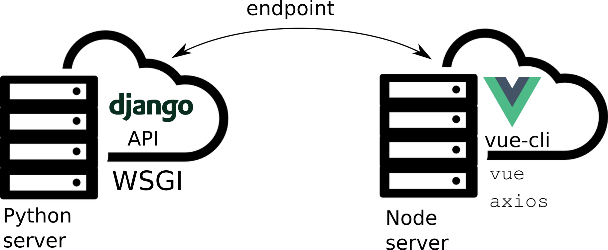

# django-vuejs-03-separated

Django e VueJS separados. Rodando em portas diferentes.

Neste projeto eu uso [Django][1] apenas como um serviço de APIs, e uso o [VueJS][2] com todos os recursos que o [vue-cli](https://cli.vuejs.org/) pode oferecer.



## Como rodar o projeto?

Em Dev rodar **dois** servidores, back e front.

### Backend

* Clone esse repositório.
* Crie um virtualenv com Python 3.
* Ative o virtualenv.
* Instale as dependências.
* Rode as migrações.
* Crie um super usuário

```
git clone https://github.com/rg3915/django-vuejs-03-separated.git
cd django-vuejs-03-separated
cd backend
python -m venv .venv
source .venv/bin/activate
pip install -r requirements.txt
python contrib/env_gen.py
python manage.py migrate
```

Para rodar o Django, dentro da pasta backend, digite:

```
python manage.py runserver
```

Isso vai rodar o servidor de back na porta **8000**.


### Frontend

Para rodar o VueJS, abra uma **nova aba no terminal**, e faça:

```
cd ../frontend
npm install  # primeiro precisa instalar o vue e suas dependências.
npm run serve
```

Isso vai rodar o servidor de front na porta **8080**.


## Comandos pra criar o projeto do zero

### Criando o projeto Django

```
mkdir backend
cd backend
python -m venv .venv
source .venv/bin/activate
pip install -U pip; pip install django==2.2.12 django-extensions python-decouple dj-database-url
django-admin startproject myproject .
cd myproject
python ../manage.py startapp core
cd ..
python manage.py migrate
# Crie um super usuário
python manage.py createsuperuser --username="admin"
```

#### Criando uma pasta chamada contrib com um env_gen.py

O comando a seguir pega `env_gen.py` do gist e clona na pasta `/tmp`.

[nvm gist][4]

```
git clone https://gist.github.com/22626de522f5c045bc63acdb8fe67b24.git /tmp/contrib; if [ ! -d contrib ]; then mkdir contrib; fi; cp /tmp/contrib/env_gen.py contrib/
# rode este comando para gerar o .env (variáveis de ambiente).
python contrib/env_gen.py
```

Em `settings.py` insira em `INSTALLED_APPS`...

```
INSTALLED_APPS = [
    ...
    'django_extensions',
    'myproject.core'
]
```

Edite este trecho do `settings.py`:

```
import os
from decouple import config, Csv
from dj_database_url import parse as dburl

BASE_DIR = os.path.dirname(os.path.dirname(os.path.abspath(__file__)))

# SECURITY WARNING: keep the secret key used in production secret!
SECRET_KEY = config('SECRET_KEY')

# SECURITY WARNING: don't run with debug turned on in production!
DEBUG = config('DEBUG', default=False, cast=bool)

ALLOWED_HOSTS = config('ALLOWED_HOSTS', default=[], cast=Csv())
```

E este trecho, onde vamos usar o sqlite:

```
default_dburl = 'sqlite:///' + os.path.join(BASE_DIR, 'db.sqlite3')
DATABASES = {
    'default': config('DATABASE_URL', default=default_dburl, cast=dburl),
}
```

No final do arquivo também edite:

```
LANGUAGE_CODE = 'pt-br'

TIME_ZONE = 'America/Sao_Paulo'
```

E

```
STATIC_URL = '/static/'
STATIC_ROOT = os.path.join(BASE_DIR, 'staticfiles')
```

Se você mudar a pasta default dos estáticos, então faça:

```
# opcional
STATICFILES_DIRS = [
    os.path.join(BASE_DIR, "static"),
    'myproject/core/templates/static/',
]
```

Depois entre na pasta

```
cd myproject/core/
```

e vamos editar o `views.py`.

```
cat << EOF > views.py
from django.contrib.auth.models import User
from django.http import JsonResponse


def api_users(request):
    users = User.objects.all()
    data = [
        {'username': user.username}
        for user in users
    ]
    response = {'data': data}
    return JsonResponse(response)
EOF
```

Agora vamos criar um `urls.py` na pasta `core`.

```
cat << EOF > urls.py
from django.urls import path
from myproject.core import views as v


app_name = 'core'


urlpatterns = [
    path('api/users/', v.api_users, name='users'),
]
EOF
```

Volte para a pasta `myproject` e edite o `urls.py` principal:

```
cd ..

cat << EOF > urls.py
from django.contrib import admin
from django.urls import include, path

urlpatterns = [
    path('', include('myproject.core.urls')),
    path('admin/', admin.site.urls),
]
EOF
```

Basicamente o backend está pronto.


#### Gravando alguns dados no banco

Vamos criar alguns usuários no Django, para isso vá para a pasta onde está o `manage.py` e digite:

```
python manage.py shell_plus
```

Depois digite:

```
names = ['fulano', 'beltrano', 'cicrano']
[User.objects.create(username=name) for name in names]
```

Agora vamos para o front.

### Frontend

Volte para a pasta principal do projeto:

Eu estou usando o Node 12, que instalei via [nvm][4].

```
# pasta principal do projeto
cd ..
nvm use 12
vue create frontend
cd frontend
```

#### Servindo o front

Para rodar o VueJS, abra uma **nova aba no terminal**, e faça:

```
cd ../frontend
npm run serve
```

Isso vai rodar o servidor de front na porta **8080**.

#### Rodando o servidor Django

```
cd ../backend
python manage.py runserver
```

Isso vai rodar o servidor de back na porta **8000**.

## Finalizando o front

Entre na pasta `frontend`.

Vamos instalar o [bootstrap-vue](https://bootstrap-vue.js.org/).

```
npm install bootstrap-vue
```

Vamos editar o arquivo `main.js`:

```
cat << EOF > src/main.js
import Vue from 'vue'
import App from './App.vue'
import BootstrapVue from 'bootstrap-vue'
import 'bootstrap/dist/css/bootstrap.css'
import 'bootstrap-vue/dist/bootstrap-vue.css'

Vue.config.productionTip = false
Vue.use(BootstrapVue);

new Vue({
  render: h => h(App),
}).\$mount('#app')
EOF
```

Vamos criar um componente Navbar.

```
cat << EOF > src/components/Navbar.vue
<template>
  <b-navbar toggleable="md" type="light" variant="light">
    <b-navbar-toggle target="nav_collapse"></b-navbar-toggle>
    <b-navbar-brand href="#">NavBar</b-navbar-brand>
    <b-collapse is-nav id="nav_collapse">
      <b-navbar-nav>
        <b-nav-item :to="{'name': 'index'}">Home</b-nav-item>
      </b-navbar-nav>
    </b-collapse>
  </b-navbar>
</template>
EOF
```

Em `App.vue` precisamos registrar esse componente.

```
cat << EOF > src/App.vue
<template>
  <div id="app">
    <Navbar/>
    
    <HelloWorld msg="Welcome to Your Vue.js App"/>
  </div>
</template>

<script>
import HelloWorld from './components/HelloWorld.vue'
import Navbar from './components/Navbar.vue'

export default {
  name: 'app',
  components: {
    HelloWorld,
    Navbar
  }
}
</script>

<style>
#app {
  font-family: 'Avenir', Helvetica, Arial, sans-serif;
  -webkit-font-smoothing: antialiased;
  -moz-osx-font-smoothing: grayscale;
  text-align: center;
  color: #2c3e50;
}
</style>
EOF
```

E vamos editar `HelloWorld.vue`.

```
cat << EOF > src/components/HelloWorld.vue
<template>
  <div class="hello">
    <h1>{{ msg }}</h1>
    <p>
      For a guide and recipes on how to configure / customize this project,<br>
      check out the
      <a href="https://cli.vuejs.org" target="_blank" rel="noopener">vue-cli documentation</a>.
    </p>
    <p>Este é um projeto feito com <a href="https://www.djangoproject.com/" target="_blank">Django</a> e <a href="https://vuejs.org/" target="_blank">VueJS</a>.</p>
    <p>
      <a href="https://github.com/rg3915/django-vuejs-03-separated" target="_blank">Veja no GitHub</a>
    </p>
  </div>
</template>

<script>
export default {
  name: 'HelloWorld',
  props: {
    msg: String
  }
}
</script>

<!-- Add "scoped" attribute to limit CSS to this component only -->
<style scoped>
h3 {
  margin: 40px 0 0;
}
ul {
  list-style-type: none;
  padding: 0;
}
li {
  display: inline-block;
  margin: 0 10px;
}
a {
  color: #42b983;
}
</style>
EOF
```

Vamos criar mais um componente:

```
cat << EOF > src/components/Users.vue
<template>
  <div>
    <b-container>
      <b-table striped hover :items="users"></b-table>
    </b-container>
  </div>
</template>
<script>
export default {
  data() {
    return {
      users: [
        { 'username': 'huguinho' },
        { 'username': 'zezinho' },
        { 'username': 'luizinho' },
      ]
    }
  }
}
</script>
EOF
```

E registre o novo componente em `App.vue`.

```
    ...
    <HelloWorld msg="Welcome to Your Vue.js App"/>
    <Users/>

...
import Users from './components/Users.vue'

export default {
  name: 'app',
  components: {
    HelloWorld,
    Navbar,
    Users  # <-----
  }
}
```

Agora vamos usar o [axios][3] para fazer chamadas para o backend.

```
npm install axios
```

E edite novamente `Users.vue`.

```
cat << EOF > src/components/Users.vue
<template>
  <div>
    <b-container>
      <b-table striped hover :items="users"></b-table>
    </b-container>
  </div>
</template>
<script>
import axios from 'axios'

const endpoint = 'http://localhost:8000/'

export default {
  data() {
    return {
      users: []
    }
  },
  created() {
    axios.get(endpoint + 'api/users/')
      .then(response => {
        this.users = response.data.data;
      })
  }
}
</script>
EOF
```

Aqui nós teremos um grande problema:

```
Access to XMLHttpRequest at 'http://localhost:8000/api/users/' from origin 'http://localhost:8080' has been blocked by CORS policy: No 'Access-Control-Allow-Origin' header is present on the requested resource.
```

Este é o famoso problema de [CORS headers][5]. Para resolver isso, vamos instalar uma lib no Django.

Entre na pasta **backend**.

```
pip install django-cors-headers
```

Depois vá em `settings.py`:

```
INSTALLED_APPS = [
    ...
    'corsheaders',
    ...
]
```

Em `MIDDLEWARE` acrescente:

```
MIDDLEWARE = [
    ...
    'corsheaders.middleware.CorsMiddleware',
    'django.middleware.common.CommonMiddleware',
    ...
]

CORS_ORIGIN_ALLOW_ALL = True
```

Prontinho!!!


[1]: https://www.djangoproject.com/
[2]: https://vuejs.org/
[3]: https://github.com/axios/axios
[4]: https://gist.github.com/rg3915/6fad3d19f2b511ec5da40cef5a168ca5
[5]: https://pypi.org/project/django-cors-headers/
